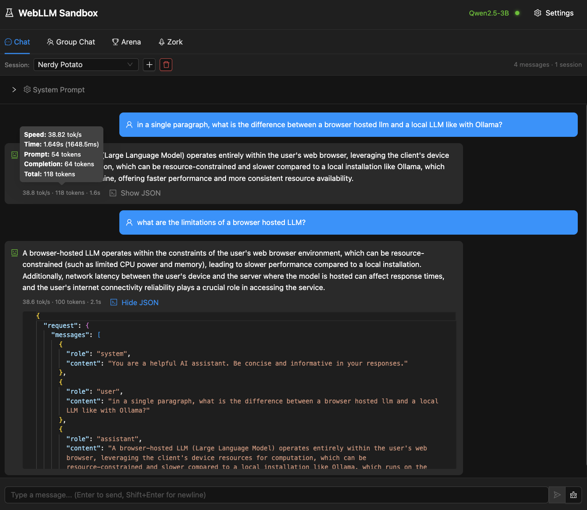
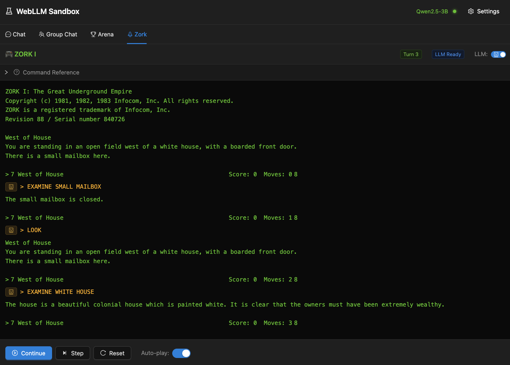
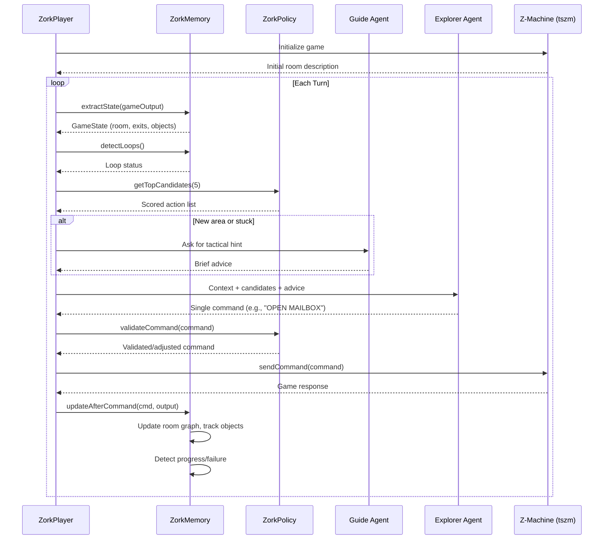

# WebLLM Sandbox

I have been messing around with browser based LLMs for a few different reasons and I thought I'd go ahead and create a quick sandbox that I could use to entertain different scenarios. These LLMs run client side and so the prompts are processed locally, no prompts go over the wire. Since this is all client-side and the browser hosted LLMs only work if you have supported hardware (WebGPU).

You can try this out now HERE hosted on github pages.

A React-based sandbox for experimenting with browser-based LLMs using [WebLLM](https://github.com/mlc-ai/web-llm). Run language models directly in your browser with no server required.

## Features

- **Chat** - Direct conversation with browser-based LLMs, with adjustable temperature and token limits
- **Group Chat** - Multi-agent conversations where AI personas discuss topics with each other
- **Arena** - Combat simulation between AI-controlled characters (Fighter vs Barbarian)
- **Zork** - Watch an LLM play the classic text adventure game with structured memory and exploration policy

### Settings panel


The Settings panel lets you choose from available browser-based LLMs, configure the system prompt, adjust temperature (0.0–2.0) for response creativity, and set max tokens for response length. All settings persist to browser storage.
Models are loaded directly into the browser cache, once cached, it's loaded from cache. 

### Chat

A straightforward chat interface for conversing with the loaded model. Includes a configurable system prompt, adjustable temperature and max tokens, and session management with auto-persisted chat history. Sessions get random fun names (like "Cosmic Penguin" or "Spicy Walrus") and you can switch between multiple conversations. Each response shows generation stats including tokens per second and total duration.




### Group Chat

Multi-agent conversations where you define personas and watch them interact. Create agents with distinct personalities—a skeptical scientist, an enthusiastic inventor, a cautious philosopher—then pose a topic and let them debate. Each agent maintains its own conversation context and responds in character. Useful for exploring how small models handle role-playing and multi-turn dialogue.

### Arena

A turn-based combat simulation between two LLM-controlled characters: Aldric the Fighter and Grimjaw the Barbarian. Each turn, agents receive their character sheet (HP, attack, defense, weapon, potion) and opponent status, then choose an action: attack, defend, use potion, or wait. The system parses their responses, resolves combat mechanics, and narrates the results. Demonstrates constrained decision-making where the LLM must output structured choices rather than freeform text.


## Zork Experimentation

The Zork tab explores whether a small browser-based LLM can play a classic text adventure game. This is an experiment in structured agent design—giving an LLM memory and policy systems to compensate for its limited context and reasoning ability.



### Architecture

The system uses two cooperating agents:

**Explorer Agent** - The player. Receives game output and structured context, outputs a single Zork command. Uses low temperature (0.2) for deterministic command selection.

**Guide Agent** - A coach that periodically reviews the game state and provides tactical hints. Activated when the Explorer seems stuck or enters a new area.

### Structured Memory

Rather than relying on raw conversation history (which small LLMs handle poorly), the system maintains explicit structured memory:

**Short-term Memory**
- Rolling window of recent commands with results (progress/no-change/failure)
- Stuck counter and forbidden command list
- Compressed game summary (refreshed every 5 turns by the Guide)

**Long-term Memory**
- Room graph with exits, objects, and visit counts
- Tracked objects: examined, taken, remaining
- Unresolved leads: locked doors, closed containers, puzzles

### Exploration Policy

The `ZorkPolicy` generates scored candidate actions based on priorities:

1. **Unresolved leads** (+3) - Locked doors, closed containers in current room
2. **New objects** (+2) - Unexamined or untaken items
3. **Untried exits** (+2) - Directions not yet explored
4. **Info gathering** (+1) - LOOK, INVENTORY when uncertain
5. **Tried exits** (+0) - Fallback for backtracking

The policy also detects loops (repeated commands, A/B alternation) and temporarily forbids problematic commands.

### Turn Sequence



### Why This Matters

Text adventures are deceptively hard for LLMs:
- Require persistent state tracking across many turns
- Need systematic exploration, not random wandering
- Demand exact command syntax
- Punish repetition and loops

This experiment tests whether explicit memory + policy scaffolding can make small models (~135M-3B parameters) viable for tasks that typically require much larger models.

### This is hard! 

The outcome of this after quite few iterations is that the LLMs are terrible at playing Zork in this form. After doing some more research it's been confirmed that an LLM is probably not the right model for this, and needs heavy assistance to navigate and see change. This is a fun challenge though. I have another change coming in that allows us to break out of the browser, pipe calls to a service or a local Ollama. I'll return to this puzzle though. Clone and try your own?


## Getting Started

```bash
# Install dependencies
npm install

# Start development server
npm run dev
```

Open http://localhost:4004 and select a model to begin.

## Available Scripts

| Command | Description |
|---------|-------------|
| `npm run dev` | Start development server |
| `npm run build` | Production build |
| `npm run start` | Dev server + log server |
| `npm run logs` | Start WebSocket log server (port 9100) |

## Tech Stack

- React 18 + TypeScript
- [WebLLM](https://github.com/mlc-ai/web-llm) - Browser-based LLM inference
- Ant Design - UI components
- Monaco Editor - Code/JSON viewing
- [tszm](https://github.com/ArcaneNibble/tszm) - TypeScript Z-Machine for Zork


## Browser Requirements

- Chrome, Edge, or other Chromium-based browser recommended
- WebGPU support for optimal performance (falls back to WebGL)
- Sufficient GPU memory for model loading (varies by model size)

## License

MIT
